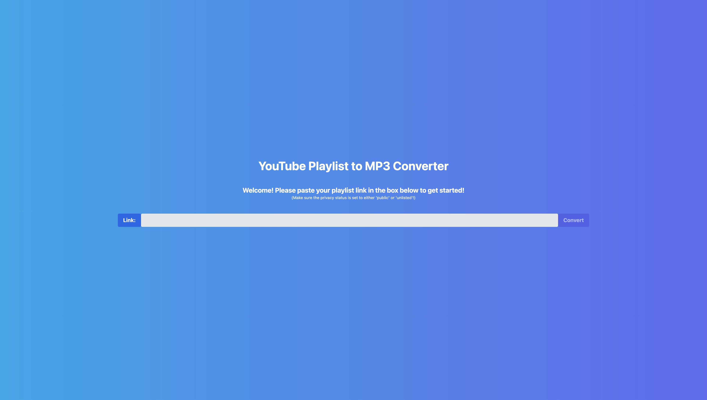
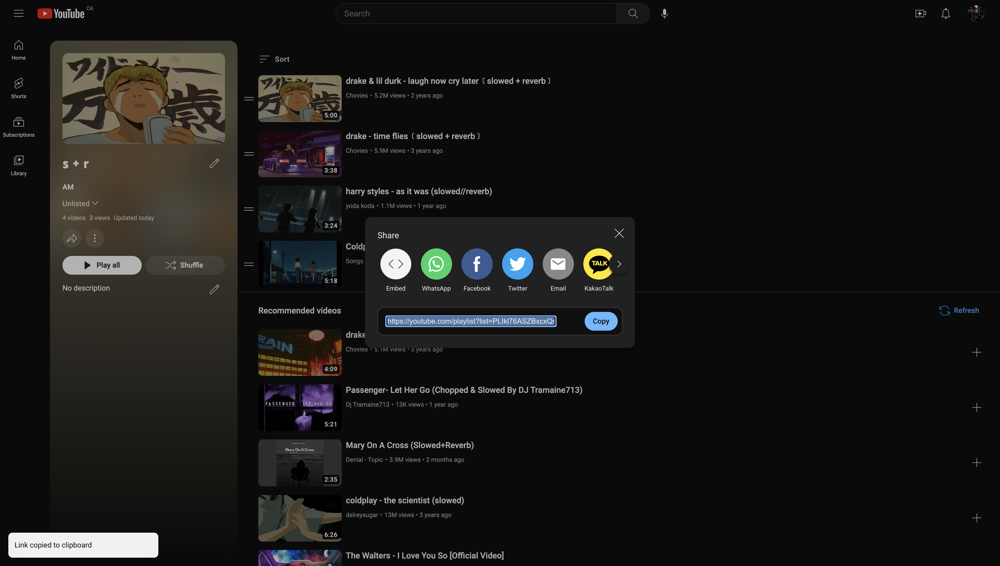
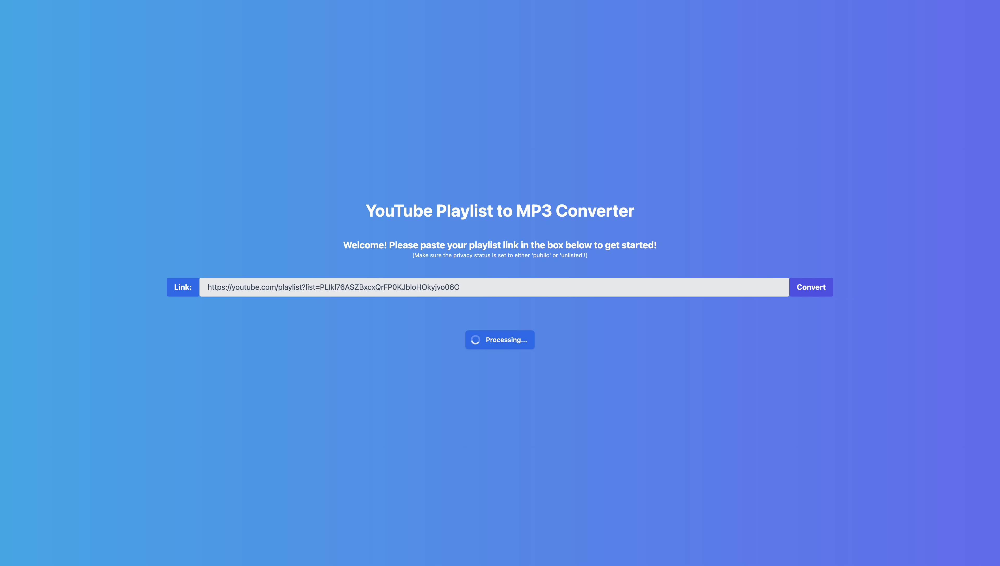
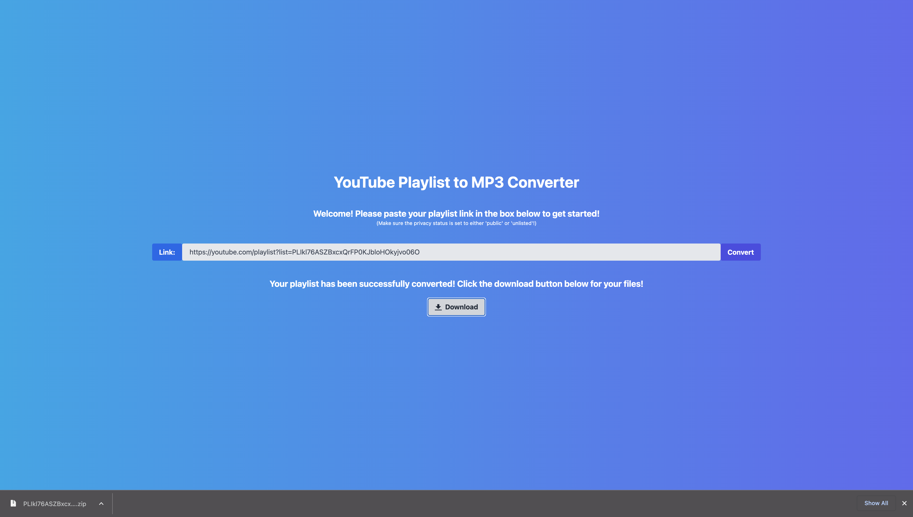

#### Readme

# Youtube Playlist to MP3 Converter

## Description

YouTube has significantly more material than any streaming service can currently offer. Content is regularly removed from Youtube, and that has personally affected me as I've lost music I'll never get to hear again. For this reason, I convert some content to MP3 format via 3rd party websites so I can have a personal copy to listen to. I've always been curious about the inner workings of these converters and also hesistant about viruses, etc. 
I created this project to automate a tedious task and further my own knowledge. Previously, converting my YouTube playlists to MP3 format was very inefficient. I would have to convert each video in my playlist individually. Now, I can simply provide this application the link to my playlist and it will handle everything. 

Note: Videos over 10 minutes long will not be converted. To update this to suit your needs, see 'yt.length' on "main.py" 

Note: Initial backend code was obtained from: https://github.com/vastevenson/python-youtube-mp3-downloader

## Installation

1. Clone this repository. 
2. Open your terminal and create 2 instances/tabs. Navigate to the root directory, then "cd" into the client and backend folders respectively. 
3. In your backend terminal, create a virtual environment via "python3 -m venv venv", then activate via "source venv/bin/activate". Then run "python3 install -r requirements.txt". Finally, run "python3 server.py".
4. In your client terminal, run "npm install", then "npm start". 

## Usage

### Demo

### Screenshots

#### Step 1. Landing Page ####

#### Step 2. Copy Playlist ID ####

#### Step 3. Paste Playlist ID and click the Convert button ####

#### Step 4. Click the Download button ####

#### Step 5. Unzip the downloaded zipped folder and access your files ####

